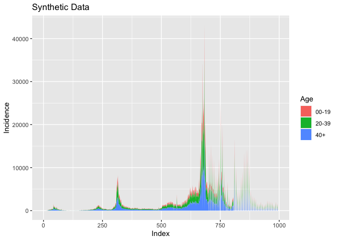

Example 1 - Generating synthetic data from COVID-19 Cases
================

The first step (after installing the package) is to load the library,
along with the library dplyr, tidyr and ggplot2.

``` r
library(dplyr)
library(ggplot2)
library(tidyr)
library(p2synthr)
```

Check the dataset `owid`

``` r
owid
```

    ## # A tibble: 235,693 × 67
    ##    iso_code continent locat…¹ date       total…² new_c…³ new_c…⁴ total…⁵ new_d…⁶
    ##    <chr>    <chr>     <chr>   <date>       <dbl>   <dbl>   <dbl>   <dbl>   <dbl>
    ##  1 AFG      Asia      Afghan… 2020-02-24       5       5  NA          NA      NA
    ##  2 AFG      Asia      Afghan… 2020-02-25       5       0  NA          NA      NA
    ##  3 AFG      Asia      Afghan… 2020-02-26       5       0  NA          NA      NA
    ##  4 AFG      Asia      Afghan… 2020-02-27       5       0  NA          NA      NA
    ##  5 AFG      Asia      Afghan… 2020-02-28       5       0  NA          NA      NA
    ##  6 AFG      Asia      Afghan… 2020-02-29       5       0   0.714      NA      NA
    ##  7 AFG      Asia      Afghan… 2020-03-01       5       0   0.714      NA      NA
    ##  8 AFG      Asia      Afghan… 2020-03-02       5       0   0          NA      NA
    ##  9 AFG      Asia      Afghan… 2020-03-03       5       0   0          NA      NA
    ## 10 AFG      Asia      Afghan… 2020-03-04       5       0   0          NA      NA
    ## # … with 235,683 more rows, 58 more variables: new_deaths_smoothed <dbl>,
    ## #   total_cases_per_million <dbl>, new_cases_per_million <dbl>,
    ## #   new_cases_smoothed_per_million <dbl>, total_deaths_per_million <dbl>,
    ## #   new_deaths_per_million <dbl>, new_deaths_smoothed_per_million <dbl>,
    ## #   reproduction_rate <dbl>, icu_patients <dbl>,
    ## #   icu_patients_per_million <dbl>, hosp_patients <dbl>,
    ## #   hosp_patients_per_million <dbl>, weekly_icu_admissions <dbl>, …
    ## # ℹ Use `print(n = ...)` to see more rows, and `colnames()` to see all variable names

Extract cases (from Ireland) as a vector

``` r
irl <- owid |>
        filter(location=="Ireland") |>
        pull(new_cases)

head(irl)
```

    ## [1] 1 0 0 1 4 0

``` r
summary(irl)
```

    ##     Min.  1st Qu.   Median     Mean  3rd Qu.     Max.     NA's 
    ##     0.00    16.75   420.00  1706.30  1496.25 43199.00        5

Call the function `synth1()` with the following arguments

-   The input vector from which the synthetic data will be created
-   The argument `group_names` which contains the sub-group names
-   The argument `group_prob` which holds the probability of each group
    bring selected

``` r
irl_syn_age <- synth1(irl,
                  group_names=c("00-19","20-39","40+"),
                  group_prob = c(0.20,0.40,0.40))

irl_syn_age
```

    ## # A tibble: 993 × 5
    ##    Index Input `00-19` `20-39` `40+`
    ##    <int> <dbl>   <dbl>   <dbl> <dbl>
    ##  1     1     1       0       0     1
    ##  2     2     0       0       0     0
    ##  3     3     0       0       0     0
    ##  4     4     1       0       0     1
    ##  5     5     4       0       4     0
    ##  6     6     0       0       0     0
    ##  7     7    12       2       8     2
    ##  8     8     0       0       0     0
    ##  9     9     1       0       0     1
    ## 10    10     2       0       1     1
    ## # … with 983 more rows
    ## # ℹ Use `print(n = ...)` to see more rows

``` r
sample_n(irl_syn_age,10)
```

    ## # A tibble: 10 × 5
    ##    Index Input `00-19` `20-39` `40+`
    ##    <int> <dbl>   <dbl>   <dbl> <dbl>
    ##  1   983     0       0       0     0
    ##  2   199   207      48      88    71
    ##  3   364   773     156     292   325
    ##  4   744     0       0       0     0
    ##  5   459   337      66     142   129
    ##  6   630  3133     580    1295  1258
    ##  7   580  1267     260     524   483
    ##  8   384   581     111     238   232
    ##  9   627  4407     895    1782  1730
    ## 10   735  3995     781    1614  1600

For convenience, convert the output to tidy data.

``` r
irl_tidy <- irl_syn_age |>
               pivot_longer(names_to="Age",
                            values_to="Incidence",
                            `00-19`:`40+`)

irl_tidy
```

    ## # A tibble: 2,979 × 4
    ##    Index Input Age   Incidence
    ##    <int> <dbl> <chr>     <dbl>
    ##  1     1     1 00-19         0
    ##  2     1     1 20-39         0
    ##  3     1     1 40+           1
    ##  4     2     0 00-19         0
    ##  5     2     0 20-39         0
    ##  6     2     0 40+           0
    ##  7     3     0 00-19         0
    ##  8     3     0 20-39         0
    ##  9     3     0 40+           0
    ## 10     4     1 00-19         0
    ## # … with 2,969 more rows
    ## # ℹ Use `print(n = ...)` to see more rows

Plot the results.

``` r
ggplot(irl_tidy,aes(x=Index,y=Incidence,fill=Age))+geom_area()+ggtitle("Synthetic Data")
```

<!-- -->
