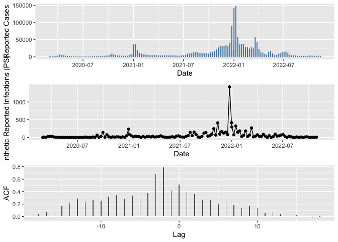

Example 2 - Generating synthetic participatory surveillance data
================

The first step (after installing the package) is to load the library,
along with the library dplyr, lubridate, ggpubr and ggplot2.

``` r
library(p2synthr)
library(lubridate)
library(dplyr)
library(ggpubr)
library(ggplot2)
```

Our goal is to create a plausible signal of weekly particpatory
surveillance results, based on the input signal of real cases (our world
in data for COVID-19). We take in daily values fro Ireland, add the year
and week, and group by year and week, summing all the new cases.

``` r
irl <- owid %>%
        select(date,location,new_cases) %>%
        mutate(year=year(date),
               week=week(date)) %>%
        filter(location=="Ireland") %>%
        group_by(year,week) %>%
        summarise(date=first(date),cases=sum(new_cases,na.rm=T))
```

    ## `summarise()` has grouped output by 'year'. You can override using the
    ## `.groups` argument.

``` r
irl
```

    ## # A tibble: 144 × 4
    ## # Groups:   year [3]
    ##     year  week date       cases
    ##    <dbl> <dbl> <date>     <dbl>
    ##  1  2020     9 2020-02-29     2
    ##  2  2020    10 2020-03-04    32
    ##  3  2020    11 2020-03-11   189
    ##  4  2020    12 2020-03-18  1106
    ##  5  2020    13 2020-03-25  1906
    ##  6  2020    14 2020-04-01  2474
    ##  7  2020    15 2020-04-08  5770
    ##  8  2020    16 2020-04-15  4561
    ##  9  2020    17 2020-04-22  3837
    ## 10  2020    18 2020-04-29  2106
    ## # … with 134 more rows
    ## # ℹ Use `print(n = ...)` to see more rows

Next, we call the function `synth_ps()`, which generates the
participatory signal. The parameters include:

-   The real cases
-   The dates, as a date format
-   The population size
-   The estimated reporting fraction. We assume that not all people have
    been. detected, but that they may be detected by a participatory
    surveillance system. So the total number of cases is amplified to
    take this into account.
-   The proportion enrolled, values such as half of one percent are
    reasonable.
-   The leading time for the signal. We assume that the paricipatory
    surveillance system will pick up infections before the public health
    surveillance system. Two weeks might be somewhat long, but it is
    used just to test the function.
-   The false postive fraction, which models people making an incorrect
    diagnosis for an illness. This will increase the number of
    notifications.
-   Whether to used a seed (`set_seed`) and what the seed should be
    `SEED`.
-   The size parameter for the [negative binomial
    distribution](https://betanalpha.github.io/assets/case_studies/probability_densities.html#32_the_negative_binomial_family),
    the lower, the more noisy the sampled data. As the size increases,
    then the distribution starts to approximate the Poisson
    distribution.
-   The range for active users, which is the proportion of registered
    users who report each week.

``` r
ps <- synth_ps(pull(irl,cases),
               dates=pull(irl,date),
               population_size = 5000000,
               reporting_fraction = 0.70,
               proportion_enrolled = 0.005,
               leading_time = 2,
               false_positive_fraction = 0.05,
               set_seed = F,
               SEED=100,
               rbinomial_size = 2,
               active_users_lower = 0.65,
               active_users_upper = 0.80)
```

The output tibble contains all the information used in calculating the
synthetic values.

    ## Rows: 144
    ## Columns: 17
    ## $ Index               <int> 1, 2, 3, 4, 5, 6, 7, 8, 9, 10, 11, 12, 13, 14, 15,…
    ## $ Date                <date> 2020-02-29, 2020-03-04, 2020-03-11, 2020-03-18, 2…
    ## $ Year                <dbl> 2020, 2020, 2020, 2020, 2020, 2020, 2020, 2020, 20…
    ## $ Week                <dbl> 9, 10, 11, 12, 13, 14, 15, 16, 17, 18, 19, 20, 21,…
    ## $ WeeklyCases         <dbl> 2, 32, 189, 1106, 1906, 2474, 5770, 4561, 3837, 21…
    ## $ ReportingFraction   <dbl> 0.7, 0.7, 0.7, 0.7, 0.7, 0.7, 0.7, 0.7, 0.7, 0.7, …
    ## $ EstimatedCasesDet   <int> 2, 45, 270, 1580, 2722, 3534, 8242, 6515, 5481, 30…
    ## $ Population          <dbl> 5e+06, 5e+06, 5e+06, 5e+06, 5e+06, 5e+06, 5e+06, 5…
    ## $ ProportionEnrolled  <dbl> 0.005, 0.005, 0.005, 0.005, 0.005, 0.005, 0.005, 0…
    ## $ LeadingTime         <dbl> 2, 2, 2, 2, 2, 2, 2, 2, 2, 2, 2, 2, 2, 2, 2, 2, 2,…
    ## $ FPFraction          <dbl> 0.05, 0.05, 0.05, 0.05, 0.05, 0.05, 0.05, 0.05, 0.…
    ## $ TotalEnrolled       <dbl> 25000, 25000, 25000, 25000, 25000, 25000, 25000, 2…
    ## $ WeeklyActiveUsers   <dbl> 16774, 17379, 17668, 16271, 18973, 18865, 18364, 1…
    ## $ AttackRateReported  <dbl> 0.0000004, 0.0000064, 0.0000378, 0.0002212, 0.0003…
    ## $ AttackRateEstimated <dbl> 5.714286e-07, 9.142857e-06, 5.400000e-05, 3.160000…
    ## $ PSReportedCasesMean <dbl> 1, 5, 11, 14, 32, 23, 20, 11, 6, 6, 3, 2, 1, 1, 0,…
    ## $ PSSyntheticReported <dbl> 1, 11, 2, 27, 30, 30, 17, 5, 7, 3, 1, 3, 0, 2, 0, …

We can now show the results via three plots. These include:

-   A plot of the cases (real data)
-   A time series of synthetic weekly reported cases via participatory
    surveillance
-   A ccf plot showing the lagged relationships between the synthetic
    data and teh real cases.

<!-- -->

    ## Warning: Removed 2 row(s) containing missing values (geom_path).

    ## Warning: Removed 2 rows containing missing values (geom_point).

<!-- -->
