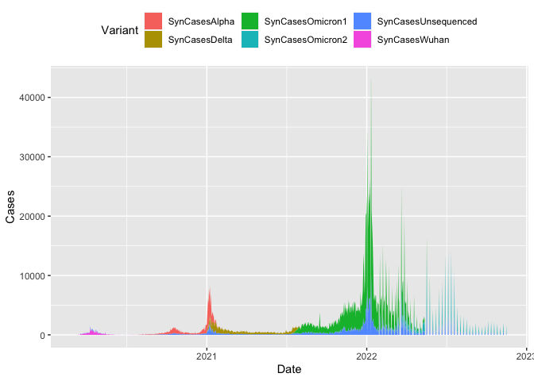
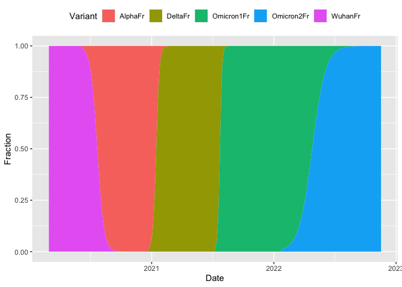

Example 3 - Generating synthetic variant case data
================

The first step (after installing the package) is to load the library,
along with the library dplyr, ggplot2 and tidyr.

``` r
library(p2synthr)
library(dplyr)
library(ggplot2)
library(tidyr)
```

Our goal is to create a realistic time series of cases by variant.
First, we gather sample case data from our world in data.

``` r
irl <- owid |>
  filter(location=="Ireland") |>
  select(date,new_cases)
irl
```

    ## # A tibble: 993 × 2
    ##    date       new_cases
    ##    <date>         <dbl>
    ##  1 2020-02-29         1
    ##  2 2020-03-01         0
    ##  3 2020-03-02         0
    ##  4 2020-03-03         1
    ##  5 2020-03-04         4
    ##  6 2020-03-05         0
    ##  7 2020-03-06        12
    ##  8 2020-03-07         0
    ##  9 2020-03-08         1
    ## 10 2020-03-09         2
    ## # … with 983 more rows
    ## # ℹ Use `print(n = ...)` to see more rows

Next, we call the function `synth_var()`, which breaks out the cases by
variant. The variant dynamics are generated by a cascade of five
logistic growth models. The parameters to `synth_variants()` include:

-   `cases_ts` - the time series of cases (required)
-   `the_dates` - the dates (R date object) for each time series
    (required)
-   `percent_genomic_surveillance_min`, a number between \[0,1\]
    indicating the lower percentage of cases sequenced (has defaults)
-   `percent_genomic_surveillance_max`, a number between \[0,1\]
    indicating the lower percentage of cases sequenced (has defaults)
-   `variant_start_time_fractions` a vector of four values indicating at
    what percentage of overall time a new variant seeds (has defaults)
-   `variant_growth_rates`, the growth rates of variants 2 to 5. (has
    defaults)
-   `variant_names`, the variant names (has defaults)
-   `setSeed`, dafault = FALSE
-   `seedValue`, default = 100

``` r
synth_var <- synth_variants(pull(irl,new_cases),
                            pull(irl,date),
                            percent_genomic_surveillance_min = 0.7,
                            percent_genomic_surveillance_max = 0.9)
synth_var
```

    ## # A tibble: 993 × 16
    ##     time Date       WuhanFr AlphaFr DeltaFr Omicron1Fr Omicron…¹ Total…² Seque…³
    ##    <dbl> <date>       <dbl>   <dbl>   <dbl>      <dbl>     <dbl>   <dbl>   <dbl>
    ##  1     1 2020-02-29       1       0       0          0         0       1    0.73
    ##  2     2 2020-03-01       1       0       0          0         0       0    0.89
    ##  3     3 2020-03-02       1       0       0          0         0       0    0.85
    ##  4     4 2020-03-03       1       0       0          0         0       1    0.75
    ##  5     5 2020-03-04       1       0       0          0         0       4    0.87
    ##  6     6 2020-03-05       1       0       0          0         0       0    0.78
    ##  7     7 2020-03-06       1       0       0          0         0      12    0.87
    ##  8     8 2020-03-07       1       0       0          0         0       0    0.75
    ##  9     9 2020-03-08       1       0       0          0         0       1    0.89
    ## 10    10 2020-03-09       1       0       0          0         0       2    0.84
    ## # … with 983 more rows, 7 more variables: SequencedCases <dbl>,
    ## #   SynCasesWuhan <dbl>, SynCasesAlpha <dbl>, SynCasesDelta <dbl>,
    ## #   SynCasesOmicron1 <dbl>, SynCasesOmicron2 <dbl>, SynCasesUnsequenced <dbl>,
    ## #   and abbreviated variable names ¹​Omicron2Fr, ²​TotalCases,
    ## #   ³​SequencingFraction
    ## # ℹ Use `print(n = ...)` to see more rows, and `colnames()` to see all variable names

The output tibble contains a breakldown of cases by variant (include
those that have not been sequenced)

    ## Rows: 993
    ## Columns: 16
    ## $ time                <dbl> 1, 2, 3, 4, 5, 6, 7, 8, 9, 10, 11, 12, 13, 14, 15,…
    ## $ Date                <date> 2020-02-29, 2020-03-01, 2020-03-02, 2020-03-03, 2…
    ## $ WuhanFr             <dbl> 1, 1, 1, 1, 1, 1, 1, 1, 1, 1, 1, 1, 1, 1, 1, 1, 1,…
    ## $ AlphaFr             <dbl> 0, 0, 0, 0, 0, 0, 0, 0, 0, 0, 0, 0, 0, 0, 0, 0, 0,…
    ## $ DeltaFr             <dbl> 0, 0, 0, 0, 0, 0, 0, 0, 0, 0, 0, 0, 0, 0, 0, 0, 0,…
    ## $ Omicron1Fr          <dbl> 0, 0, 0, 0, 0, 0, 0, 0, 0, 0, 0, 0, 0, 0, 0, 0, 0,…
    ## $ Omicron2Fr          <dbl> 0, 0, 0, 0, 0, 0, 0, 0, 0, 0, 0, 0, 0, 0, 0, 0, 0,…
    ## $ TotalCases          <dbl> 1, 0, 0, 1, 4, 0, 12, 0, 1, 2, 13, 9, 0, 47, 39, 0…
    ## $ SequencingFraction  <dbl> 0.73, 0.89, 0.85, 0.75, 0.87, 0.78, 0.87, 0.75, 0.…
    ## $ SequencedCases      <dbl> 1, 0, 0, 1, 3, 0, 10, 0, 1, 2, 11, 7, 0, 35, 31, 0…
    ## $ SynCasesWuhan       <dbl> 1, 0, 0, 1, 3, 0, 10, 0, 1, 2, 11, 7, 0, 35, 31, 0…
    ## $ SynCasesAlpha       <dbl> 0, 0, 0, 0, 0, 0, 0, 0, 0, 0, 0, 0, 0, 0, 0, 0, 0,…
    ## $ SynCasesDelta       <dbl> 0, 0, 0, 0, 0, 0, 0, 0, 0, 0, 0, 0, 0, 0, 0, 0, 0,…
    ## $ SynCasesOmicron1    <dbl> 0, 0, 0, 0, 0, 0, 0, 0, 0, 0, 0, 0, 0, 0, 0, 0, 0,…
    ## $ SynCasesOmicron2    <dbl> 0, 0, 0, 0, 0, 0, 0, 0, 0, 0, 0, 0, 0, 0, 0, 0, 0,…
    ## $ SynCasesUnsequenced <dbl> 0, 0, 0, 0, 1, 0, 2, 0, 0, 0, 2, 2, 0, 12, 8, 0, 5…

We can now plot the results, by tidying the data.The area plot shows how
the synthetic model shows the different dominance stages of the five
different viruses.

    ## Warning: Removed 30 rows containing missing values (position_stack).

<!-- -->

Finally, the “market share” of the viruses can be shown, and these are
driven by the parameters `variant_start_time_fractions` and
`variant_growth_rates`.

<!-- -->
